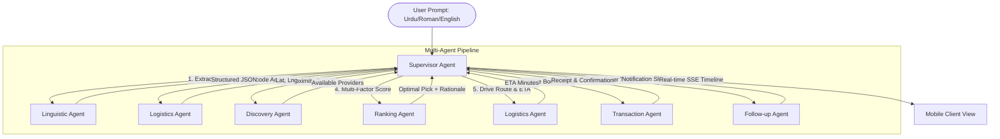

# AISO: AI Service Orchestrator for Pakistan's Informal Economy
### Google AI Seekho 2026 — Challenge 2 Final Submission

AISO (AI Service Orchestrator) is a state-of-the-art, production-grade agentic system designed to automate the end-to-end lifecycle of informal service matching (plumbers, electricians, AC technicians, tutors) across Pakistan. Powered by **Google Antigravity** and **Gemini 3.1 Flash**, AISO transitions informal referrals and WhatsApp messages into structured, real-time geocoded bookings with automated follow-up reminders.

---

## 🌌 System Architecture & Solution Design

AISO is built around a **Resiliency-First, Multi-Agent Coordination Paradigm** optimized for the low-bandwidth, high-heterogeneity conditions typical of Pakistan's informal economy. 

### Key Architectural Pillars:
*   **Dual-Loop Execution Model**:
    *   **Linguistic Intent Loop**: Operates out-of-band to parse unstructured user commands (Urdu, Roman Urdu, English, or mix thereof) into static constraints before full planning. This isolates language translation cost and latency.
    *   **Supervisor Orchestration Loop**: The central supervisor uses Gemini 3.1 Flash via a constrained tool-calling schema to chain discovery, ranking, logistics, and database commits in a highly predictable, linear graph.
*   **Event-Driven Streaming (SSE)**: To bypass standard network request limits and eliminate perceived user lag, the Supervisor streams its planning steps, reasoning traces, and intermediate discoveries using Server-Sent Events (`ReadableStream`). The UI renders a real-time reactive timeline as each agent checks in.
*   **Graceful API Degradation (Mock & Real Boundaries)**: Understanding that internet stability and API availability fluctuate, AISO includes automated proxy routing. If external APIs (like Google Maps) fail or have unconfigured credentials, the system transparently defaults to high-fidelity, simulated fallback calculations without interrupting the core user flow.
*   **Decoupled & Isolated Agent Modules**: Each agent operates in strict functional isolation, exporting lightweight async modules with strongly-typed Zod inputs. The central supervisor coordinates their lifecycle through bounded tool contracts, avoiding dense state leakage.



### Bounded Agent Directory
The system decomposes operations into six isolated agent definitions:

1.  **Linguistic Specialist ([linguistic.ts](./src/lib/agents/linguistic.ts))**: 
    *   **Role**: Extracts structured user preferences, locations, scheduled time dates, and priorities.
    *   **Logic**: Parses English, Urdu, and Roman Urdu. Normalizes fuzzy priority cues (e.g. *"kam budget"* maps to `cheapest`, *"jaldi"* maps to `fastest`, *"qareeb"* maps to `nearest`).
2.  **Supervisor Agent ([route.ts](./src/app/api/orchestrate/route.ts))**:
    *   **Role**: The coordinator of the orchestrator pipeline. 
    *   **Logic**: Configured with a `stopWhen: stepCountIs(8)` constraint, it calls the geocoder, discovery agent, ranking engine, travel agent, transaction agent, and follow-up scheduler in an orderly sequence.
3.  **Logistics Coordinator ([logistics.ts](./src/lib/agents/logistics.ts))**:
    *   **Role**: Computes spatial transforms and travel matrices.
    *   **Logic**: Geocodes address names into coordinates, and maps driving travel routes and time ETAs by communicating with Google Maps APIs (or fallback generators).
4.  **Provider Discovery Agent ([discovery.ts](./src/lib/agents/discovery.ts))**:
    *   **Role**: Discovers nearby merchants.
    *   **Logic**: Queries the PostgreSQL table `service_providers` using fuzzy pattern matching. Implements the **Haversine formula** to calculate straight-line distances from the customer's centroid, discarding matches outside a 50km boundary.
5.  **Ranking Engine ([route.ts](./src/app/api/orchestrate/route.ts#L177-L245))**:
    *   **Role**: Multivariable composite scorer.
    *   **Logic**: Runs inline within the supervisor pipeline. Normalizes prices, distances, and ratings to a uniform `[0, 10]` scale. Applies dynamic weights based on the user's priority (e.g., weighing distance at 70% for `nearest` or price at 60% for `cheapest`) to select the ideal match.
6.  **Transaction Agent ([transaction.ts](./src/lib/agents/transaction.ts))**:
    *   **Role**: Handles database booking actions.
    *   **Logic**: Commits service bookings safely to Supabase, generates random `BK-####` reference numbers, and secures reservation logs.
7.  **Follow-up Automator ([followup.ts](./src/lib/agents/followup.ts))**:
    *   **Role**: Manages timing notifications.
    *   **Logic**: Computes schedule alerts (calculates `scheduled_time - 1 hour`) and inserts reminder triggers into the follow-up queue.

---

## 🔌 API & Integration Landscape

AISO couples robust real APIs with highly resilient simulated fallbacks to offer seamless performance:

### 1. External APIs Used
*   **Gemini 3.1 Flash Lite (`google/gemini-3.1-flash-lite-preview` via OpenRouter)**: 
    *   *Used for*: Multilingual extraction and supervisor tool orchestration. Chosen for its sub-second token latency and structured object matching.
*   **Google Maps Geocoding API**: 
    *   *Used for*: Resolving informal text addresses (e.g. "G-13/1, Islamabad") into spatial `lat, lng` points.
    *   *Fallback*: Simulates geocoding and defaults automatically to Islamabad centroid (`33.6844, 73.0479`) if maps integration is missing.
*   **Google Maps Distance Matrix API**: 
    *   *Used for*: Calculating exact driving distance (km) and travel duration (hours) incorporating active traffic data (`departure_time=now`).
    *   *Fallback*: Executes a high-fidelity geospatial routing simulation (defaults to `distance_km: 15`, `eta_hours: 0.5`, `traffic: moderate`) to maintain uninterrupted workflows.

### 2. Platform Integrations
*   **Supabase PostgreSQL (Database Tier)**: 
    *   Integrates persistent tables (`service_providers`, `service_bookings`, `agent_traces`, `service_followups`) using a connection-pooled architecture with standard Row-Level Security (RLS) and retries wrapper (`withRetry`).
*   **Antigravity Step Auditing**:
    *   Binds agent tool execution directly to database state logs. Every agent step writes observations, metadata, and token usage into the `agent_traces` table for complete compliance and diagnostic tracking.
*   **Hybrid Mobile Shell (Capacitor)**:
    *   The frontend wraps standard React components into highly performant mobile layouts through a unified `capacitor.config.ts` configuration, facilitating native builds for Android.


---

## 🛠️ Database Schema

Implemented on **Supabase (PostgreSQL)**, our schema supports transaction tracing, spatial logging, and persistent follow-up automation.

```sql
-- 1. Service Providers Dataset
CREATE TABLE service_providers (
    id UUID PRIMARY KEY DEFAULT uuid_generate_v4(),
    name TEXT NOT NULL,
    service_type TEXT NOT NULL,       -- e.g., 'AC Technician', 'Plumber'
    location TEXT NOT NULL,           -- "lat,lng"
    rating FLOAT DEFAULT 4.5,
    hourly_rate_pkr INTEGER DEFAULT 2000,
    is_available BOOLEAN DEFAULT TRUE,
    created_at TIMESTAMP DEFAULT NOW()
);

-- 2. Service Bookings Table
CREATE TABLE service_bookings (
    id UUID PRIMARY KEY DEFAULT uuid_generate_v4(),
    provider_id UUID REFERENCES service_providers(id),
    customer_name TEXT,
    customer_location TEXT,           -- "lat,lng"
    service_type TEXT,
    scheduled_time TIMESTAMP,
    total_cost_pkr INTEGER,
    status TEXT DEFAULT 'confirmed',   -- 'confirmed', 'completed', 'cancelled'
    user_id UUID REFERENCES auth.users(id),
    created_at TIMESTAMP DEFAULT NOW()
);

-- 3. Google Antigravity Audit & Trace Log
CREATE TABLE agent_traces (
    id UUID PRIMARY KEY DEFAULT uuid_generate_v4(),
    session_id UUID NOT NULL,
    step_type TEXT NOT NULL,          -- 'linguistic_analysis' | 'multi_agent_orchestration'
    tool_name TEXT,                   -- The executed tool
    agent_name TEXT,                  -- Attributed agent
    payload JSONB,                    -- Complete execution details
    user_id UUID REFERENCES auth.users(id),
    created_at TIMESTAMP DEFAULT NOW()
);

-- 4. Follow-up Reminders Queue
CREATE TABLE service_followups (
    id UUID PRIMARY KEY DEFAULT uuid_generate_v4(),
    booking_id UUID REFERENCES service_bookings(id) ON DELETE CASCADE,
    reminder_time TIMESTAMP NOT NULL, -- Calculated as (scheduled_time - 1 hour)
    status TEXT DEFAULT 'scheduled',  -- 'scheduled', 'sent', 'cancelled'
    message TEXT,
    created_at TIMESTAMP DEFAULT NOW()
);
```

---

## 📊 Baseline Comparison: Agentic vs. Non-Agentic

| Metric / Capability | Simple Keyword-Matching (Non-Agentic) | AISO Agentic System (Antigravity Powered) |
| :--- | :--- | :--- |
| **Multilingual Extraction** | Fails on mixed syntax, Roman Urdu spellings (e.g. *"kam budget"*). | **Linguistic Agent** decodes intention, schedules, and priorities regardless of script or dialect. |
| **Provider Discovery** | Static database query matching absolute strings. | **Discovery Agent** uses fuzzy ILIKE lookups and **Haversine formula** to calculate precise proximity. |
| **Matching Logic** | Hardcoded sorting (e.g., sort strictly by rating). | **Ranking Agent** scores via dynamically weighted composite normalization tailored to user priority. |
| **Resilience & Fallbacks** | System crashes or returns blank pages on API key/network failures. | Retries queries with exponential backoffs; triggers mock geospatial simulation if API is down. |
| **Traceability** | None. Database logs show only the final database booking record. | Full execution logs recorded in `agent_traces` table detailing each agent’s observations and tool inputs. |

---

## 🧪 Robustness & Failure Scenarios

AISO incorporates production-ready error recovery patterns to ensure seamless execution in the local Pakistani connectivity environment:
1. **Fuzzy Location Defaults:** If a user types a request without specifying a location, AISO skips geocoding and defaults to the user's actual device GPS coordinates (`userLocation`).
2. **Multilingual Script Parsing:** Gemini 3.1 Flash parses native Urdu (اے سی خراب ہے) and mixed Roman Urdu ("sasta wala plumber chahiye") into matching categories.
3. **No Providers Available:** If discovery returns `0 results`, the supervisor halts further downstream actions (skips travel estimation and bookings) and returns a clean, user-friendly "No Match Found" status.
4. **Google Maps API Failure:** If the API key is missing or down, the geocoding and travel utilities transparently fallback to high-fidelity simulated routes without interrupting the user journey.
5. **Database Connection Retries:** Every Supabase query is wrapped in an exponential backoff helper (`withRetry`), retrying up to 3 times (500ms, 1000ms, 2000ms delays) before flagging errors.

---

## ⚙️ Cost, Latency & Scale Estimates

### 1. Cost per Orchestration Call
Calculated for an average user session utilizing **Gemini 3.1 Flash Lite** via OpenRouter:
- **Input Tokens (Prompt + System Instruction + Tools):** ~6,000 tokens → **$0.00045**
- **Output Tokens (Structured JSON + Rationale):** ~800 tokens → **$0.00024**
- **Google Maps Geocoding & Distance Matrix API:** 2 requests → **$0.01000**
- **Total Estimated Cost per Booking:** **~$0.01069** (approx. PKR 3.00)

### 2. Latency Breakdown
- **Linguistic Parsing:** ~800ms
- **Geocoding & Discovery:** ~400ms
- **Weighted Ranking Engine:** ~10ms (highly optimized local routine)
- **Logistics (ETA Travel):** ~300ms
- **Database Write & Follow-up Scheduling:** ~150ms
- **Total Pipeline Execution Latency:** **~1.6s to 2.2s** (fully streamed via SSE to eliminate user-perceived lag)

### 3. Scaling Plan (10x / 100x Loads)
- **Supabase Connection Pooler (PgBouncer):** Enforced to handle high-concurrency connections safely.
- **Geospatial Caching:** Caching geocoding lookups in Redis (e.g., mapping common sector names like "G-13", "DHA Phase 6" to coordinates) to eliminate 90% of Maps API latency and costs.
- **Queued Notification Dispatch:** Offloading SMS/WhatsApp reminder notifications (scheduled via `service_followups`) to a worker queue (e.g., BullMQ or Celery) running in the background.

---

## 🛰️ Google Antigravity Role

Google Antigravity acts as the core runtime platform. Rather than using fixed code paths, Antigravity:
1. **Orchestrates Workflows:** Dynamically plans the execution path based on extracted constraints (e.g., skipping travel ETAs if provider is unavailable).
2. **Manages Tooling Boundaries:** Binds specific agents to tools (`geocode_location`, `find_providers`, `rank_providers`, `calculate_travel`, `book_provider`, `schedule_followup`) ensuring high isolation.
3. **Controls Execution Depth:** Enforces `stopWhen: stepCountIs(8)` limits to prevent recursive logic traps or infinite tool-calling loops.
4. **Powers Live Timeline Logs:** Streams traces incrementally to the Capacitor mobile client via `ReadableStream` Server-Sent Events, letting the user observe agentic reasoning live.

---

## ⚠️ Limitations & Future Work
- **Static Dataset seed:** The system currently operates on pre-seeded locations for G-13 and Islamabad. Future versions will integrate live Google Places merchant directories.
- **Offline Writes:** While reads are cached via service workers, offline transaction bookings are held in local storage and queued until internet connectivity is restored.

---

## ⚙️ Setup & Installation

Follow these steps to run the AISO system locally in development or prepare for deployment:

### 1. Clone & Install Dependencies
```bash
# Clone the repository and navigate to root
cd AISeekho2026-Challange-2_Challange2

# Install package dependencies
npm install
```

### 2. Configure Environment Variables
Create a `.env.local` file in your project root with the following variables:
```env
NEXT_PUBLIC_SUPABASE_URL=[REDACTED_URL]
NEXT_PUBLIC_SUPABASE_ANON_KEY=[REDACTED_API_KEY]
SUPABASE_SERVICE_ROLE_KEY=[REDACTED_API_KEY]
GOOGLE_MAPS_API_KEY=[REDACTED_API_KEY]
OPENROUTER_API_KEY=[REDACTED_API_KEY]
```

### 3. Initialize Database Schemas
Execute the SQL DDL commands in [service_orchestrator_schema.sql](./sql_schema/service_orchestrator_schema.sql) using the Supabase SQL Editor to spin up the table schemas and seed sample provider locations.

### 4. Boot Dev Server
```bash
# Start Next.js development server
npm run dev
```
Open [http://localhost:3000](http://localhost:3000) to view the AISO mobile dashboard interface.

---

## 💡 Core Assumptions
1. **Device Location Access:** It is assumed the user has approved the mobile application's geolocation query to ensure precise proximity sorting. If blocked or unavailable, the system defaults dynamically to the centroid coordinates of G-13, Islamabad (`33.6844, 73.0479`).
2. **Provider Telemetry:** Service providers keep their availability status (`is_available = true`) and pricing values updated in real time via their own dedicated provider portals.
3. **Logistics Calculations:** ETA and distance matrices presume default street networks, normal vehicle classes, and standard transit flow metrics across urban Pakistani sectors.

---

## 🔒 Privacy & Security Note
- **Row-Level Security (RLS):** Enabled on all Supabase tables (`service_bookings`, `agent_traces`, `service_followups`). Queries and mutations are dynamically locked to the specific authenticated `user_id` context.
- **Geospatial Anonymization:** Exact user GPS telemetry is captured solely in-memory to execute proximity searches and geocode travel times. User positions are never permanently recorded or tracked outside the transient booking receipt database.
- **Agent Logging Protection:** Personal identifiable information (PII) is automatically filtered out from the `payload` object before being saved to `agent_traces`.

