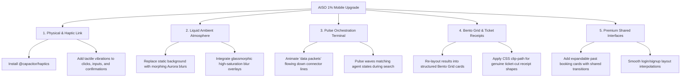

# 🪐 AISO: "Top 1%" Mobile Design & Usability Transformation Plan

This document outlines our comprehensive design audit and engineering proposal to transform **AISO** from a functional Capacitor app into an award-winning, high-fidelity mobile experience. Inspired by Apple Design Award winners, this plan leverages deep liquid glass aesthetics, physical haptic integration, and dynamic layout interfaces.

---

## 🛠️ The 5 Pillars of the 1% Experience

---

## 🎯 Proposed Transformations

### 1. 📳 The Tactile Connection: Capacitor Haptics
* **The Concept:** High-end native mobile applications feel alive because they talk to your hands. By integrating physical system haptics, AISO will physically vibrate when users interact with it.
* **The Plan:**
  - Install `@capacitor/haptics` and configure automatic fallback for browser previews.
  - **Light Tap:** Triggered when clicking bottom tabs, category cards, and prompt buttons.
  - **Medium/Selection Tap:** Triggered when focusing text inputs or switching tabs.
  - **Notification/Success Pattern:** Triggered when an agent successfully matches a provider.
  - **Warning/Error Pattern:** Triggered when a search fails or no providers are found.

### 2. 🌌 Liquid Ambient Atmosphere (Deep Dark Theme)
* **The Concept:** Static image backgrounds feel flat and rigid. We will implement a smooth, GPU-accelerated morphing aurora glow that slowly breathes in the background.
* **The Plan:**
  - Create three absolute-positioned, low-opacity, high-blur neon background circles (`bg-accent/15`, `bg-violet-500/10`, `bg-sky-500/10`).
  - Animate them using keyframes to slowly expand, rotate, and shift position over `20s` to `30s` intervals.
  - Lay a premium semi-translucent glass overlay (`backdrop-blur-[40px] saturate-[180%] bg-stone-950/60`) over the viewport to create an incredible sense of depth.

### 3. ⚡ The Pulse Orchestration Terminal
* **The Concept:** The agent traces are AISO’s super-power, but currently, they look like a static list. We want the user to *see* the computing happen in real-time.
* **The Plan:**
  - **Dynamic Pulse Lines:** Add an animating gradient glow (a "light packet") traveling down the vertical connector lines between agent nodes.
  - **Active State Shimmer:** The active agent node will have an ambient radial neon ring that pulses outwards.
  - **Success Check Animation:** When an agent finishes its work, the icon will smoothly pop in with a tactile scale spring, turning green with a micro-scale bounce.

### 4. 🍱 Bento Grid Results & Ticket-Cut Receipts
* **The Concept:** Improve scannability by grouping the results screen into an elegant, asymmetric Bento Grid structure, and style the booking confirmation to look like a physical print-out.
* **The Plan:**
  - **Bento Grid:** Arrange the map, receipt, follow-up parameters, agent insight, and latency metrics into a sleek visual grid.
  - **Ticket Receipt:** Use a CSS `clip-path` polygon to create a physical serrated "ticket edge" cut at the bottom of the confirmation card, complete with a dotted division line and a quick "Copy Code" button with a checkmark hover state.

### 5. 🔀 Premium Shared Interfaces (Past Booking Detail Expansion)
* **The Concept:** Instead of flatly closing and opening screens, AISO should feel continuous.
* **The Plan:**
  - **Expandable History:** When a user taps a past booking in "Booking History", instead of forcing a page redirection to the main tab, we will expand the card *in-place* with a gorgeous sliding height transition, displaying details immediately under the header without breaking context.
  - **Auth Screen Layouts:** Update the Sign In / Sign Up toggle to slide the input fields up and down with Framer Motion layout interpolation.

---

## 🛠️ Proposed Changes

### [MODIFY] [package.json](file:///d:/code/Others/AISeekho2026_After-Shortlisting_Project/package.json)
* **Add:** `"@capacitor/haptics": "^8.0.2"` to dependencies and sync.

### [MODIFY] [src/app/page.tsx](file:///d:/code/Others/AISeekho2026_After-Shortlisting_Project/src/app/page.tsx)
* **Add:** Dynamic background aurora layers with CSS-keyframe keyframes.
* **Add:** Client-side `@capacitor/haptics` dynamically loaded trigger triggers in hooks.
* **Add:** Staggered login forms, pulse node connector animations, and Bento grid receipt shapes.
* **Add:** In-place expandable accordion layout for past orders in `orders-tab`.

---

## 🙋 User Review Required

> [!IMPORTANT]
> **Haptic Engine Approval:** Do you want us to automatically install and synchronize the Capacitor Haptics library into your Android application? (This requires running `npm install @capacitor/haptics` and syncing).
>
> **Background Aesthetics:** Would you prefer keeping the current `/bg-mountains.png` picture visible under the new glassmorphic blurred auroras, or should we swap it entirely for a pristine, ultra-clean liquid cosmic mesh background?

---

## 📋 Verification Plan

### Automated Verification
- Run `npm run build` to verify there are absolutely no type safety issues or bundler errors.

### Manual Verification
- Test all interactive components (Tabs, Category buttons, drawer toggles) to ensure fluid haptic triggers run safely on native platforms while bypassing gracefully in web browsers.
- Verify that past orders cards expand dynamically in-place without causing screen-jumping.
